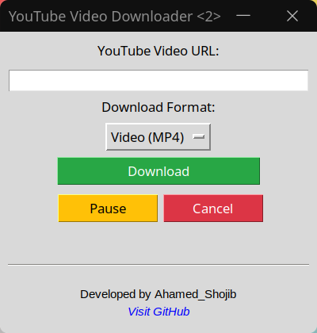

# 🎬 YouTube Download Manager (YDM)

A lightweight and easy-to-use GUI *Linux* application to download YouTube videos and audio using Python, `yt-dlp`, and `tkinter`. With real-time progress tracking, format conversion, and file management features, this tool offers a smooth and user-friendly downloading experience.

---

## 🚀 Features

- ✅ **Download YouTube Videos (MP4) or Audio (MP3)**
- 📁 **Select Download Location**
- 📊 **Live Progress Bar and Percentage**
- ⏸️ **Pause & Resume Downloading**
- 🛑 **Cancel Active Downloads**
- 🔁 **Auto Convert to MP3/MP4 Using FFmpeg**
- 📂 **Open File or Folder After Download**
- 🔍 **Detects and Skips Existing Files**
- 💻 **Cross-Platform (Windows, Linux, macOS)**

---

## 📸 Screenshot

<p>Here’s a preview of the app:</p>


---

## ⚙️ Requirements

- Python 3.6+
- `yt-dlp`
- `ffmpeg` (for format conversion)
- `tkinter` (comes pre-installed with most Python versions)

### 📦 Install Dependencies
- 1.Download the latest `.deb` package:
[Download Youtube_downloader_1.0.0.deb] (https://github.com/Ahamed-Shojib/YouTube-Downloader/blob/main/youtube_downloader.deb)
- 2.Run the command:
```bash
sudo dpkg -i youtube_downloader.deb
sudo apt --fix-broken install  # in case of missing dependencies


```
---

## ⚖️ Legal Disclaimer

This software is intended for **personal and educational use only**.

- Downloading copyrighted content without permission from the content owner may violate YouTube's Terms of Service and local copyright laws.
- This tool **does not support or encourage piracy** or any form of unauthorized downloading.
- The developer is **not responsible** for any misuse of this application by users.

By using this tool, you agree to comply with all applicable laws and the YouTube Terms of Service.

---

## ©️ Copyright

© 2025 Ahamed Shojib. All rights reserved.

This project is licensed under the [MIT License](LICENSE), allowing reuse under specified conditions. Refer to the LICENSE file for more information.


